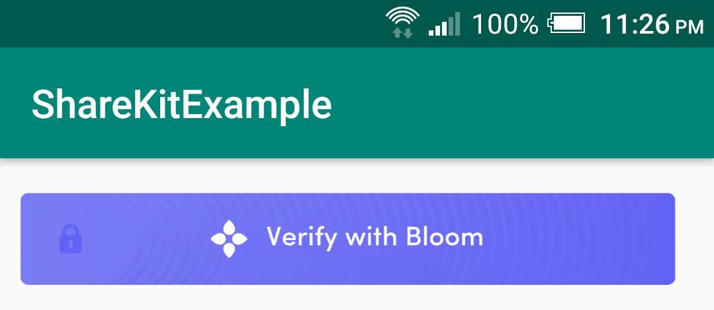
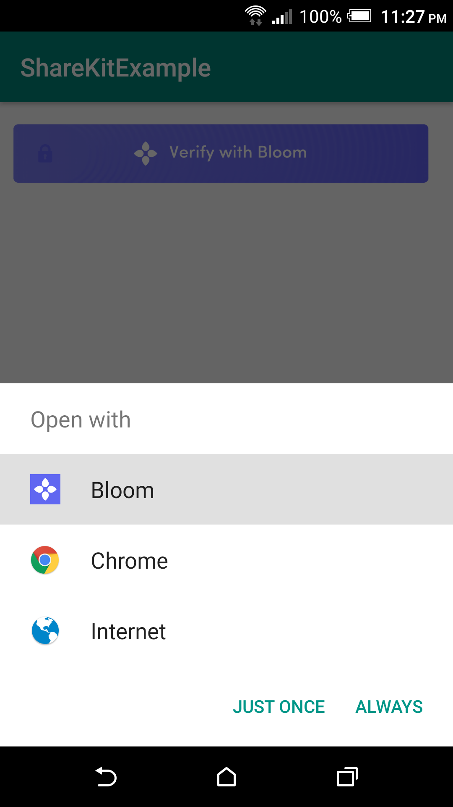

# Share Kit Android

Android implementation of [Share Kit](https://github.com/hellobloom/share-kit#readme)

## Building The Library

1. Open the `ShareKit` project in Android Studio and let the project sync with gradle.
2. When the project is ready, click on the `Build` menu and then select `Clean Project` i.e. `Build -> Clean Project`, in Android Studio.
3. Then also  click on the `Build` menu and then select `Rebuild Project` i.e. `Build -> Rebuild Project`, in Android Studio.
4. Finally navigate to the `ShareKit` directory and open the folders `app -> build -> outputs -> aar` and copy the `app-debug.aar` library file generated. Paste this file anywhere in your filesystem and preferably rename it to `sharekit.aar`

## Installation

1. Make sure your android project as a `minSdkVersion` of 16  or greater, otherwise adding the library will cause your project to fail to build.
2. Add the `sharekit.aar` library generate above by doing the [following in your Android Studio project](https://developer.android.com/studio/projects/android-library)
	- Click `File -> New -> New Module`.
    - Click `Import .JAR/.AAR Package` then click Next.
    - Enter the location of the compiled `sharekit.aar` file then click Finish.
    - Then make sure the `sharekit` library is added in your `settings.gradle` file i.e. `include ':app', ':sharekit'`
    - In your projects `build.gradle` file add a new line for the `sharekit` lib in the dependencies block 
    	i.e. 
    	    ```
    			dependencies {
    				implementation project(":sharekit")
				}
			```
	- Finally click on `Sync Project with Gradle Files` for your project to sync with the `sharekit` library. 

3. If the above steps are done successfully then you should be able to clean and Rebuild your project successfully as specified above i.e. `Build -> Clean Project` & `Build -> Rebuild Project`

## Usage

To use the share-kit `RequestButton` in your project, please do the following

# Java

1. Import the `ShareKit` class into your Activity/Fragment i.e. `import com.bloom.sharekit.ShareKit;`
2. Then initialize the `RequestButton`, set the share-kit request data & callback-url and add it to your layout view programmatically like this

```
    @Override
    protected void onCreate(Bundle savedInstanceState) {
        super.onCreate(savedInstanceState);
        setContentView(R.layout.activity_main);

        LinearLayout layout = findViewById(R.id.example_activity);

        // initialize the request data JSON Object and the types array
        JSONObject requestData = new JSONObject();
        JSONArray attestationTypes = new JSONArray();
        try {
            requestData.put("action", ShareKit.attestation);
            requestData.put("token", "0x8f31e48a585fd12ba58e70e03292cac712cbae39bc7eb980ec189aa88e24d043");
            requestData.put("url", "https://receive-kit.bloom.co/api/receive");
            requestData.put("org_logo_url", "https://bloom.co/images/notif/bloom-logo.png");
            requestData.put("org_name", "Bloom");
            requestData.put("org_usage_policy_url", "https://bloom.co/legal/terms");
            requestData.put("org_privacy_policy_url", "https://bloom.co/legal/privacy");

            // add the attestations
            attestationTypes.put("full-name");
            attestationTypes.put("phone");
            attestationTypes.put("email");
            requestData.put("types", attestationTypes);
        } catch (JSONException e) {
            e.printStackTrace();
        }

        // this is the callback-url/deep link for your app which will be used by the bloom app to re-direct you to your after the request is handled
        String callbackUrl = "https://google.com";

        // initialize the button by passsing the activity, bloom requestData and your app's callback-url
        Button bloomButton = new ShareKit().RequestButton(this, requestData, callbackUrl);

        //add button to the layout
        layout.addView(bloomButton);

        // set the button padding if necessary
        layout.setPadding(30,50,10,10);
    }
```
3. Please note for a new Android Studio project, the layout created will be a `ConstraintLayout` instead of a `LinearLayout` as shown above. Also please add an id to the layout xml file before initializing it so that it looks as follows
```
<?xml version="1.0" encoding="utf-8"?>
<android.support.constraint.ConstraintLayout 
    xmlns:android="http://schemas.android.com/apk/res/android"
    xmlns:tools="http://schemas.android.com/tools"
    android:id="@+id/example_activity"
    android:layout_width="match_parent"
    android:layout_height="match_parent"
    tools:context=".MainActivity">

   
</android.support.constraint.ConstraintLayout>
```
 - And then initialize the layout as a `ConstraintLayout` instead of a `LinearLayout` i.e. `ConstraintLayout layout = findViewById(R.id.example_activity);`
 - After this everything else in the above example will remain the same.
4. Finally build and install the apk into a device or emulator and once your app pops up, you should have the `RequestButton` displayed as below
   
5. Also the first time you tap the button, you'll be presented with a variety of options as shown below. So please select `Open With -> Bloom -> ALWAYS` so that it defaults to opening the Bloom App if its installed instead of a browser.
	

## Testing

Please open the `ShareKitExample` project in Android Studio for a test implementation of the library.


